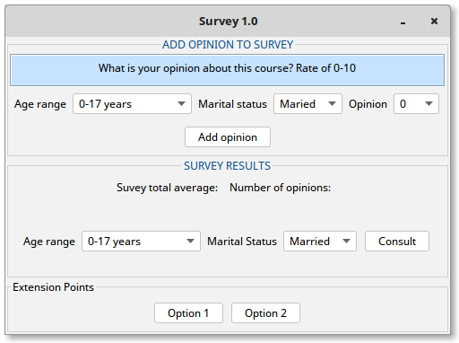

# Description

 We want to build a program to handle the results of an opinion survey. In the
 survey the people were divided in three age ranges: (1) less than 18, (2) between
 18 and 55 and (3) over 55 years. The survey consists in a single question, which
 asks the person to rate the quality of the course giving a value between 0 and 10.
 When asking the question, the person must report whether he/she is single or married.
 The program must allow to add a new opinión to the survey. That is, should allow
 to add a new person in an age range (for example, in the range 2), to rate the course
 (for example 4) and that says if he/she is married or single.

The program must report the total value of the survey. That is, should average all
the given grades and present the result on the screen. It should also be capable
to provide partial values of the survey. In this case, an age range and a marital
status must be specified. The program shows on the screen the average grades given
by all the people who has the requested profile. You can supose that at the time of
calculating the results there is at least one person from each profile.

# Interface

The interface is the one shown below:

    

